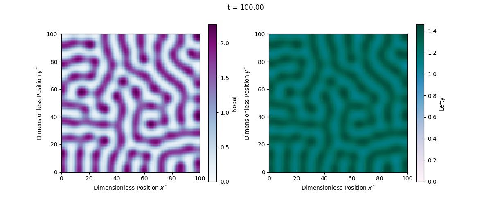
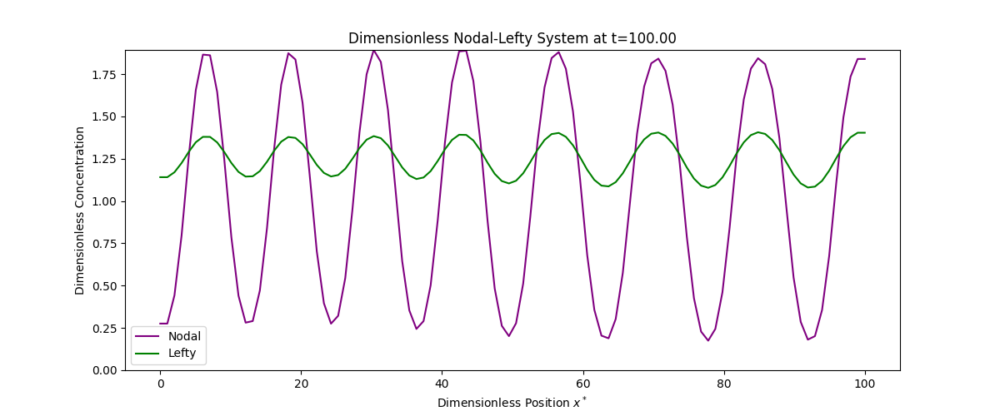

# Masters Thesis: Exploring Turing Patterns through the Simulation of Engineered Nodal and Lefty Gene Circuits

All code developed throughout throughout my master's thesis is publicly available on in this repository. 
The main part is a flexible simulation framework, designed not only for simulating a Nodal-Lefty model but also with the potential for application to other reaction-diffusion systems, for instance the Gierer-Meinhardt model is also implemented.

## Code Structure

The project is organized into the following files:

-   **`computation.py`**: This is the main script that runs the simulation.
-   **`visualization.py`**: Contains functions for creating visualization callbacks that generate plots and save data during the simulation.
-   **`settings.py`**: Manages the reading of parameters from a configuration file, parsing command-line arguments, and setting up the output directory.
-   **`ModelParameters.py`**: Defines a class to store and manage model parameters.
-   **`ReactionDiffusionModel.py`**: Implements the base class for reaction-diffusion models, along with specific implementations for the Nodal-Lefty (dimensional and dimensionless) and Gierer-Meinhardt models.
-   **`GridParameters.py`**: Defines a class to manage spatial and temporal grid parameters.
-   **`TimeStepper.py`**: Implements various time-stepping methods, including Explicit Euler, Heun and Strang splitting schemes.

## How to Run the Simulation

1. **Prerequisites:**
    -   Python 3.x
    -   Required Python packages: `numpy`, `scipy`, `matplotlib`, `configparser`

2. **Configuration File:**
    -   Parameter files are available in the `parameter` folder.

3. **Running the Simulation:**
    -   Execute the `computation.py` script from the command line, providing the parameter file and potentially other options:

    ```bash
    python computation.py -p params.ini [other options]
    ```

    -   The script will generate plots and data files in the `out` directory, organized within a subdirectory specified by the `-o` argument (default: `simulation_results`).

## Example Usage

To run a 2D simulation of the dimensionless Nodal-Lefty model with white noise initialization, Explicit Euler for time discretization, and output to the directory `my_simulation`, using the parameter file `parameter_NL_2.ini`, you would use the following command:

```bash
python computation.py -p parameter/parameter_NL_2.ini -o my_simulation -init white-noise -m NL -tdisc EE -d 2 --dimensionless --videomode
```



To run a 2D simulation of the dimensional Nodal-Lefty model with white noise initialization, Strang-Heun-Crank-Nicolson for time discretization, and output to the directory `my_simulation`, using the parameter file `parameter_NL_2.ini`, you would use the following command:

```bash
python3 computation.py -p parameter/parameter_NL_2.ini -o my_simulation -init white-noise -m NL -tdisc strang_H_CN -d 1 --dimensionless --videomode
```



## Command-Line Arguments

The `computation.py` script accepts the following command-line arguments:

-   **`-o`, `--outdir`**: Specifies the name of the output directory.
    -   Default: `simulation_results`
-   **`-init`, `--initialization`**: Specifies the method for initializing the solution.
    -   Choices:
        -   `white-noise`: Initializes with random values.
        -   `spike`: Initializes with a spike at the center of the domain.
    -   Default: `white-noise`
-   **`-vid`, `--videomode`**: Enables more frequent plotting for creating videos.
    -   Action: `store_true` (no value needed)
-   **`-dimless`, `--dimensionless`**: Indicates whether to use the dimensionless version of the model.
    -   Action: `store_true`
-   **`-p`, `--parameter`**: Specifies the path to the parameter file (required).
    -   Example: `-p params.ini`
-   **`-m`, `--model`**: Specifies the model to simulate.
    -   Choices:
        -   `NL`: Nodal-Lefty model.
        -   `GM`: Gierer-Meinhardt model.
    -   Default: `NL`
-   **`-tdisc`, `--timedisc`**: Specifies the temporal discretization method.
    -   Choices:
        -   `EE`: Explicit Euler.
        -   `H`: Heun's method.
        -   `IE`: Implicit Euler.
        -   `strang_EE_IE`: Strang splitting with Explicit Euler and Implicit Euler.
        -   `strang_H_CN`: Strang splitting with Heun's method and Crank-Nicolson.
    -   Default: `EE`
-   **`-d`, `--dimensions`**: Specifies the number of spatial dimensions.
    -   Choices: `1` or `2`.
    -   Default: `2`
